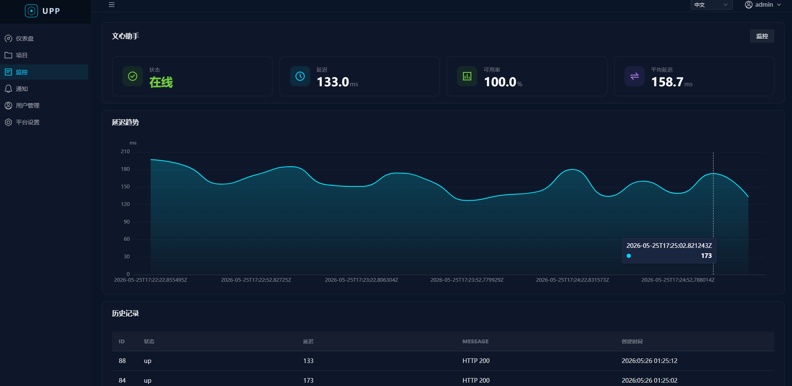
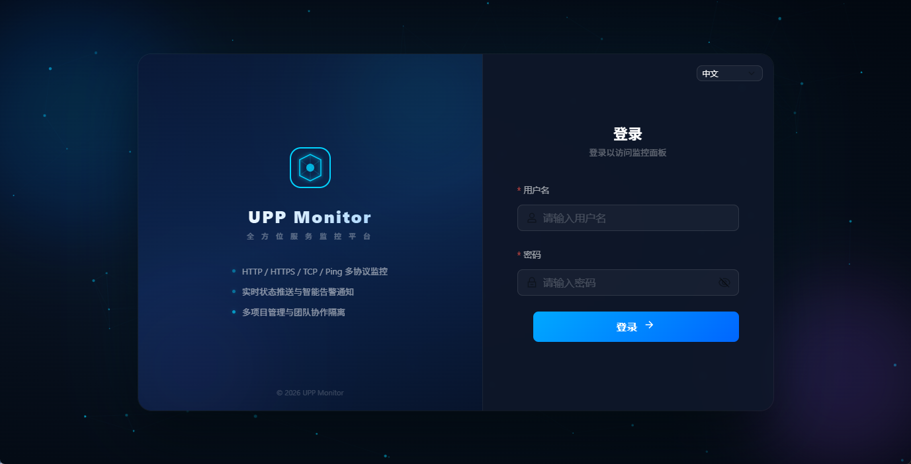
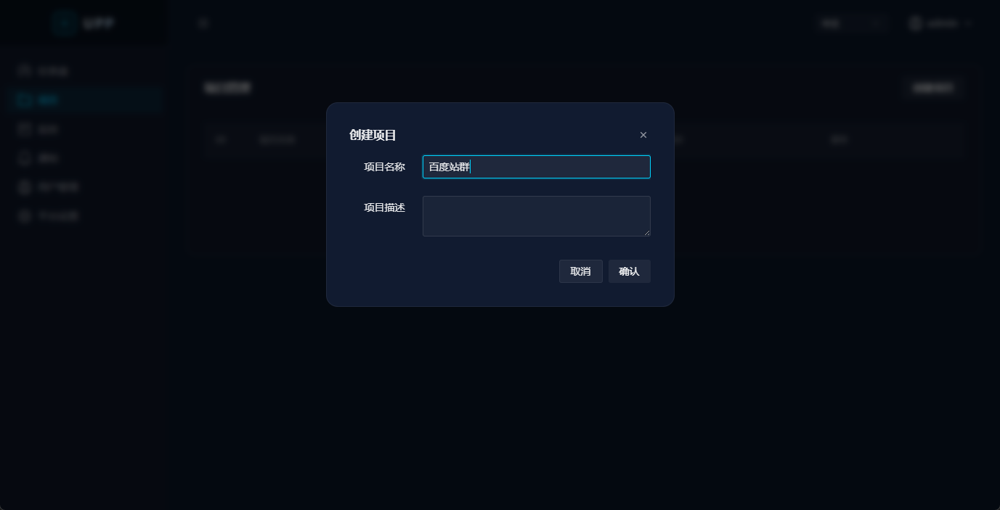
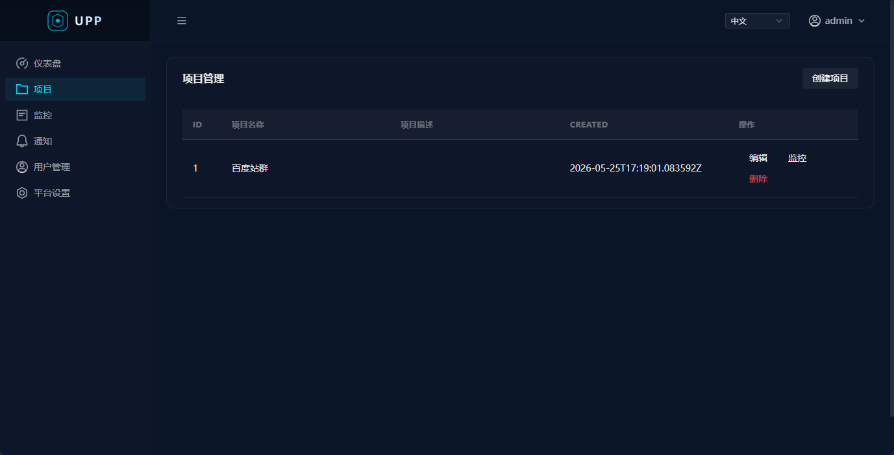
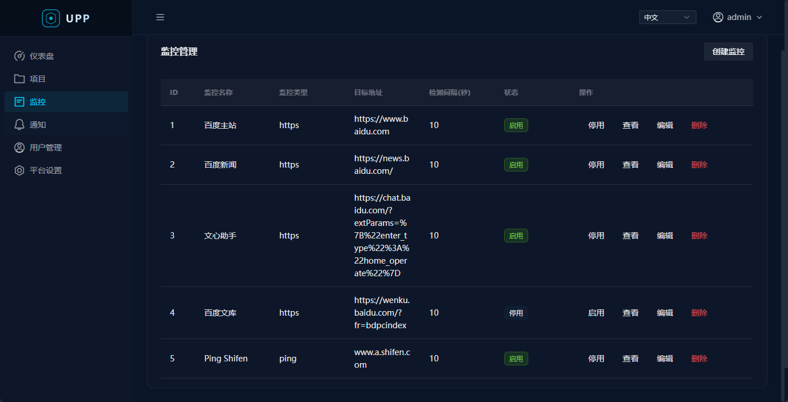
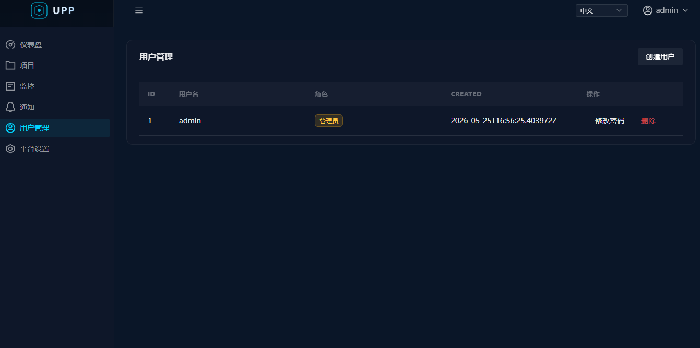
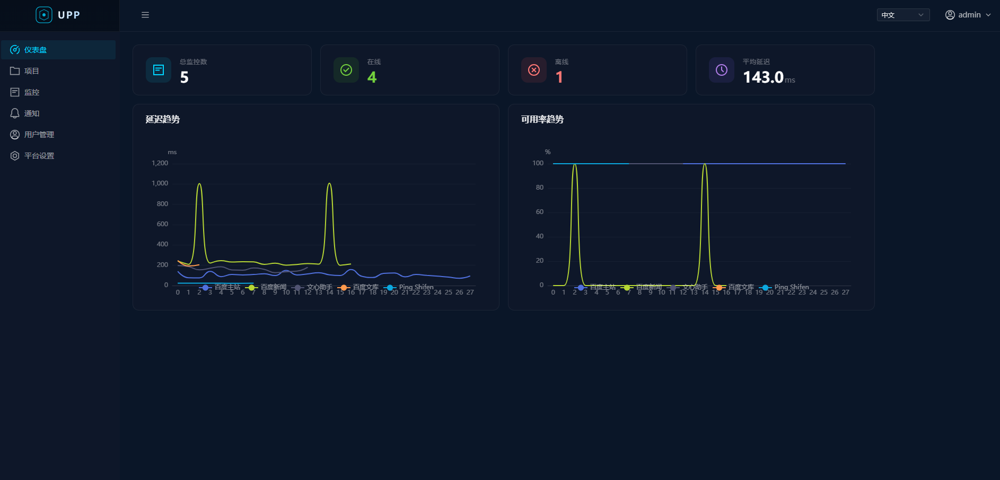
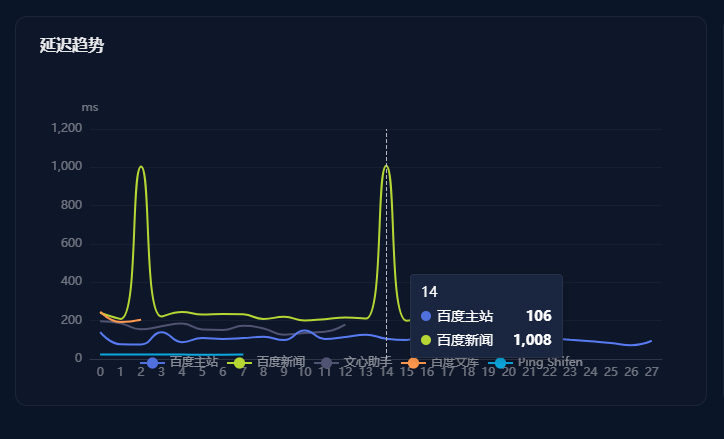
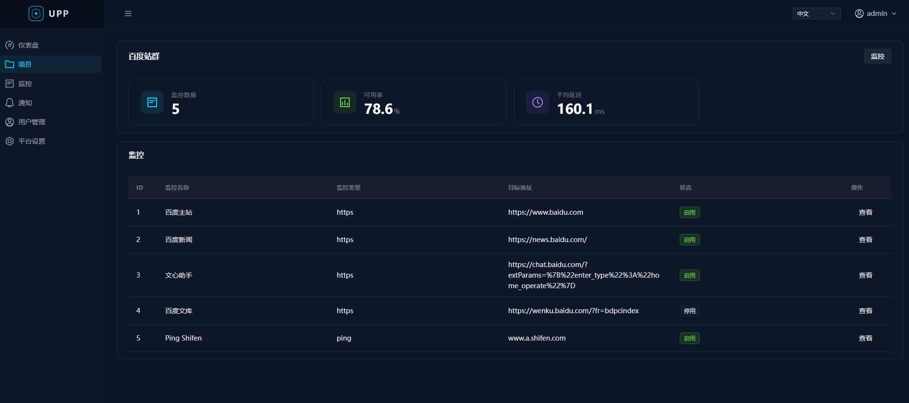

# UPP - 网站监控系统

UPP (Uptime Probe Platform) 是一个类似 Uptime Kuma 的网站监控系统，支持多种监控类型、多项目管理、多用户隔离、实时状态推送和通知告警。




















## 功能特性

- **多类型监控**：HTTP/HTTPS 网站监控、TCP 端口监控、Ping 监控
- **项目管理**：多项目分组管理监控目标，支持项目级数据隔离
- **用户系统**：多用户注册登录，管理员/普通用户角色隔离
- **实时推送**：WebSocket 实时推送监控状态变更
- **通知告警**：支持飞书、钉钉、WebHook、邮箱通知，状态变更时自动触发
- **仪表盘**：全局概览与项目级仪表盘，ECharts 可视化图表
- **中英文切换**：基于 vue-i18n 的国际化支持

## 技术栈

### 后端

| 组件 | 技术 |
|------|------|
| 语言 | Go 1.25 |
| Web 框架 | Gin |
| ORM | GORM |
| 数据库 | PostgreSQL 16 |
| 缓存 | Redis 7 |
| 认证 | JWT (golang-jwt) |
| 实时通信 | Gorilla WebSocket |
| 调度 | Goroutine + Worker Pool |
| Ping 探针 | pro-bing |

### 前端

| 组件 | 技术 |
|------|------|
| 框架 | Vue 3 + TypeScript |
| 构建 | Vite 8 |
| 状态管理 | Pinia |
| 路由 | Vue Router 4 |
| UI 组件库 | TDesign Vue Next |
| HTTP 客户端 | Axios |
| 图表 | ECharts 6 |
| 国际化 | vue-i18n 9 |

### 部署

| 组件 | 技术 |
|------|------|
| 容器化 | Docker + Docker Compose |
| 前端服务 | Nginx |

## 项目结构

```
UPP/
├── backend/                    # 后端服务
│   ├── cmd/main.go             # 入口
│   ├── internal/
│   │   ├── api/                # HTTP Handler 层
│   │   ├── config/             # 配置加载
│   │   ├── middleware/         # 中间件 (JWT, CORS)
│   │   ├── model/              # 数据模型 + 数据库初始化
│   │   ├── notification/       # 通知系统 (飞书/钉钉/WebHook/邮箱)
│   │   ├── probe/              # 监控探针 (HTTP/HTTPS/TCP/Ping)
│   │   ├── repository/         # 数据访问层
│   │   ├── scheduler/          # 调度引擎
│   │   ├── service/            # 业务逻辑层
│   │   └── websocket/          # WebSocket Hub
│   ├── config.yaml             # 配置文件
│   ├── Dockerfile
│   └── go.mod
├── frontend/                   # 前端服务
│   ├── src/
│   │   ├── api/                # API 请求封装
│   │   ├── layouts/            # 布局组件
│   │   ├── locales/            # 国际化 (en/zh)
│   │   ├── pages/              # 页面组件
│   │   ├── router/             # 路由配置
│   │   ├── stores/             # Pinia 状态
│   │   └── utils/              # 工具函数
│   ├── nginx.conf              # Nginx 配置 (含 API 代理)
│   ├── Dockerfile
│   └── package.json
└── docker-compose.yml
```

## 快速开始

### 前置要求

- Docker & Docker Compose

### 一键启动

```bash
docker-compose up -d --build
```

启动完成后：

| 服务 | 地址 |
|------|------|
| 前端界面 | http://localhost |
| 后端 API | http://localhost:8080/api/v1 |

### 默认账号

| 用户名 | 密码 | 角色 |
|--------|------|------|
| admin | admin123 | 管理员 |

## API 概览

### 公开接口

| 方法 | 路径 | 说明 |
|------|------|------|
| POST | /api/v1/auth/login | 用户登录 |
| POST | /api/v1/auth/register | 用户注册 |

### 认证接口 (需 Bearer Token)

| 方法 | 路径 | 说明 |
|------|------|------|
| GET | /api/v1/auth/profile | 获取当前用户信息 |
| GET | /api/v1/dashboard/stats | 全局仪表盘统计 |
| GET | /api/v1/dashboard/project/:id | 项目仪表盘 |
| GET/POST | /api/v1/projects | 项目列表/创建 |
| GET/PUT/DELETE | /api/v1/projects/:id | 项目详情/更新/删除 |
| GET/POST | /api/v1/monitors | 监控列表/创建 |
| GET/PUT/DELETE | /api/v1/monitors/:id | 监控详情/更新/删除 |
| PATCH | /api/v1/monitors/:id/toggle | 启停监控 |
| GET | /api/v1/monitors/:id/results | 监控检测结果 |
| GET | /api/v1/monitors/:id/stats | 监控统计 |
| GET | /api/v1/projects/:id/monitors | 项目下监控列表 |
| GET/POST | /api/v1/notifications | 通知列表/创建 |
| GET/PUT/DELETE | /api/v1/notifications/:id | 通知详情/更新/删除 |
| POST | /api/v1/notifications/:id/test | 测试通知 |
| GET | /api/v1/ws | WebSocket 连接 |

### 管理员接口

| 方法 | 路径 | 说明 |
|------|------|------|
| GET/POST | /api/v1/users | 用户列表/创建 |
| PUT | /api/v1/users/:id/password | 修改用户密码 |
| DELETE | /api/v1/users/:id | 删除用户 |
| GET/POST | /api/v1/settings | 系统设置 |

## 本地开发

### 后端

```bash
cd backend
# 需要本地运行 PostgreSQL 和 Redis
go run ./cmd/main.go
```

### 前端

```bash
cd frontend
npm install
npm run dev
```

## 配置说明

后端配置文件 `backend/config.yaml`：

```yaml
server:
  port: "8080"

database:
  host: postgres
  port: "5432"
  user: upp
  password: upp123
  dbname: upp
  sslmode: disable

redis:
  addr: redis:6379
  password: ""
  db: 0

jwt:
  secret: upp-jwt-secret-key-2024
  expire: 72  # hours
```

